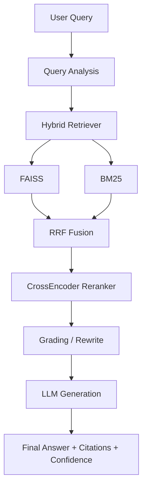

# Adaptive RAG using LangGraph

[](https://www.python.org/)
[](https://python.langchain.com/langgraph/)
[](https://fastapi.tiangolo.com/)
[](https://streamlit.io/)
[](https://github.com/facebookresearch/faiss)
[](LICENSE)

Adaptive RAG is a production-oriented Retrieval-Augmented Generation project that combines hybrid retrieval, reranking, and local LLM inference to deliver grounded answers with citations and confidence scores. The application is organized around a LangGraph workflow for routing, retrieval, grading, and generation while keeping the implementation modular and easy to validate.

## Features

- ✅ Adaptive Query Routing
- ✅ Hybrid Search
- ✅ FAISS
- ✅ BM25
- ✅ Reciprocal Rank Fusion
- ✅ CrossEncoder Reranking
- ✅ Ollama
- ✅ Source Citation
- ✅ Confidence Score
- ✅ Retrieval Analytics

## Architecture



## Project Structure

```text
Adaptive-Rag/
├── assets/                 # Screenshots and visual placeholders
├── sample_docs/            # Sample PDF placeholders for local testing
├── src/
│   ├── api/                # FastAPI routes
│   ├── config/             # Environment-driven settings and prompts
│   ├── core/               # Shared configuration helpers
│   ├── db/                 # MongoDB integration
│   ├── llms/               # LLM and embedding adapters
│   ├── memory/             # Chat history persistence
│   ├── models/             # Request and response models
│   ├── rag/                # Retriever, reranker, and agent logic
│   └── tools/              # Utility tools used by the workflow
├── streamlit_app/          # Streamlit UI
├── requirements.txt
├── .env.example
└── README.md
```

## Tech Stack

### Backend
- FastAPI
- Uvicorn
- Pydantic

### Frontend
- Streamlit

### LLM
- Ollama
- LangGraph

### Embeddings
- BAAI/bge-small-en-v1.5

### Vector Search
- FAISS
- BM25

### Reranking
- CrossEncoder
- Reciprocal Rank Fusion

### Frameworks
- LangChain
- LangChain Community
- LangChain Core

## Installation

1. Clone the repository:
   ```bash
   git clone <repository-url>
   cd Adaptive-Rag
   ```
2. Create and activate a Python virtual environment:
   ```bash
   python -m venv .venv
   .venv\Scripts\activate
   ```
3. Install dependencies:
   ```bash
   pip install -r requirements.txt
   ```
4. Copy the environment template and adjust values:
   ```bash
   copy .env.example .env
   ```

## Ollama Setup

Install and pull the default model used by the application:

```bash
ollama pull qwen3:latest
```

## Running

### Backend

```bash
uvicorn src.main:app --host 0.0.0.0 --port 8000
```

### Frontend

```bash
streamlit run streamlit_app/home.py
```

## Configuration

The application reads its runtime settings from environment variables. The required values are defined in [.env.example](.env.example) and include:

- OLLAMA_MODEL: default model for the Ollama-backed LLM
- EMBEDDING_MODEL: embedding provider identifier
- RERANKER_MODEL: reranker model used by CrossEncoder
- USE_RERANKER: enable or disable reranking
- RETRIEVAL_TOP_K: number of candidate documents fetched per retriever
- FINAL_TOP_K: number of documents returned to the generation step
- RRF_K: Reciprocal Rank Fusion parameter

## Screenshots

The following placeholders are available in the repository:

- Home: [assets/home.png](assets/home.png)
- Chat: [assets/chat.png](assets/chat.png)
- Retrieval Analytics: [assets/analytics.png](assets/analytics.png)
- Architecture: [assets/architecture.png](assets/architecture.png)
- Source Citation: [assets/citation.png](assets/citation.png)

## Future Improvements

- Add richer evaluation metrics and regression tests
- Improve deployment automation and containerization
- Expand observability for retrieval and generation latency
- Add authentication and role-based access controls

## License

This project is licensed under the MIT License. See [LICENSE](LICENSE) for details.
